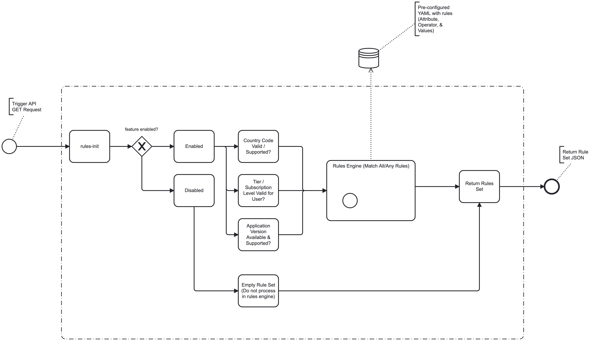

# rules-engine

[](https://www.gnu.org/licenses/gpl-3.0)

[](https://github.com/conorheffron/rules-engine/actions/workflows/maven.yml)

# Proposed Design
 - The workflow should:
   - Read Rules from app configuration
   - Store Rules in Map
   - Match Rules against incoming request parameters
 - This workflow diagram should be interactive where failed steps could be re-run to see the results of the rule evaluation etc. via the `Camunda Platform UI`.



### Sample Rules defined in app configuration for a set of `features`
 - Each `feature` can be `enabled or disabled`
 - Each rule per feature can have `attr`, `op`, & `values` value/values list.
 - `Rule Group` logic for keys `all` & `any` not implemented - see https://github.com/conorheffron/rules-engine/issues/13 for intended / expected implementation details.
```yml
feature:
  new-checkout:
    enabled: true
    ruleGroups:
      all:
        - { attr: country, op: IN, values: [ "ES", "PT" ] }
        - { attr: appVersion, op: GTE, values: [ "120" ] }
      any:
        - { attr: tier, op: IN, values: [ "gold", "platinum" ] }

  search-v2:
    enabled: false

  beta-banner:
    enabled: true

  old-checkout:
    enabled: true
    ruleGroups:
      all:
        - { attr: country, op: IN, values: [ IRL ] }
      any:
        - { attr: tier, op: IN, values: [ gold, platinum ] }
```

### Build & Run App
```shell
mvn clean install test spring-boot:run
```

### Read Rules & Store in Map
```
http://localhost:8080/api/executetask
```


### Sample API queries 
 - If Match, Return list of rules returned with HTTP Status 200 
 - else empty list & 400 Bad Request

#### Test End-Point GET Request
```
http://localhost:8080/api/test
```
#### Test End-Point Response
```
["IRE","ES"]
```


# Rule Matcher
#### No Matches (see application yml)
```
http://localhost:8080/api/eval?feature=new-checkout&country=IE&appVersion=1&tier=2
```


#### 2 Matches for feature, country, & app version rules
```
http://localhost:8080/api/eval?feature=new-checkout&country=PT&appVersion=120&tier=2
```


#### 2 Matches for feature, country, & app version rules 
```
http://localhost:8080/api/eval?feature=new-checkout&country=ES&appVersion=400&tier=2
```

#### 1 Match for feature & country
```
http://localhost:8080/api/eval?feature=new-checkout&country=ES&appVersion=100&tier=2
```


#### 2 Matches for feature, tier, & country
```
http://localhost:8080/api/eval?feature=old-checkout&country=IRL&appVersion=100&tier=gold
```


#### 3 Matches for feature, country, app version, & tier
```
http://localhost:8080/api/eval?feature=new-checkout&country=PT&appVersion=140&tier=gold
```


#### No Matches → Feature Disabled (Bad Request -> HTTP Status Code 400)
```
http://localhost:8080/api/eval?feature=search-v2&country=PT&appVersion=140&tier=gold
```


---

## Camunda UI Tools such as Cockpit, Admin Panel & Tasklist (login with credentials in yml)
```
http://localhost:8080/
```
### Screenshots of Embedded Camunda UI

#### Start Process


#### Task List


#### Cock Pit


## Sample Logs (from test cases above):
```shell
 ____                                 _         ____  _       _    __                      
/ ___| __ _ _ __ ___  _   _ _ __   __| | __ _  |  _ \| | __ _| |_ / _| ___  _ __ _ __ ___  
| |   / _` | '_ ` _ \| | | | '_ \ / _` |/ _` | | |_) | |/ _` | __| |_ / _ \| '__| '_ ` _ \ 
| |__| (_| | | | | | | |_| | | | | (_| | (_| | |  __/| | (_| | |_|  _| (_) | |  | | | | | |
\____/\__,_|_| |_| |_|\__,_|_| |_|\__,_|\__,_| |_|   |_|\__,_|\__|_|  \___/|_|  |_| |_| |_|

  Spring-Boot:  (v3.5.10)
  Camunda Platform: (v7.24.0)
  Camunda Platform Spring Boot Starter: (v7.24.0)

2026-02-01T00:46:10.882Z  INFO 33208 --- [           main] net.ironoc.rules.engine.ApiApplication   : Starting ApiApplication using Java 25 with PID 33208 (/Users/conorheffron/workspace/fd-flag-eval/target/classes started by conorheffron in /Users/conorheffron/workspace/fd-flag-eval)
2026-02-01T00:46:10.885Z  INFO 33208 --- [           main] net.ironoc.rules.engine.ApiApplication   : No active profile set, falling back to 1 default profile: "default"
2026-02-01T00:46:11.700Z  INFO 33208 --- [           main] .s.d.r.c.RepositoryConfigurationDelegate : Bootstrapping Spring Data JPA repositories in DEFAULT mode.
2026-02-01T00:46:11.721Z  INFO 33208 --- [           main] .s.d.r.c.RepositoryConfigurationDelegate : Finished Spring Data repository scanning in 12 ms. Found 0 JPA repository interfaces.
2026-02-01T00:46:12.327Z  INFO 33208 --- [           main] o.s.b.w.embedded.tomcat.TomcatWebServer  : Tomcat initialized with port 8080 (http)
2026-02-01T00:46:12.343Z  INFO 33208 --- [           main] o.apache.catalina.core.StandardService   : Starting service [Tomcat]
2026-02-01T00:46:12.343Z  INFO 33208 --- [           main] o.apache.catalina.core.StandardEngine    : Starting Servlet engine: [Apache Tomcat/10.1.50]
2026-02-01T00:46:12.407Z  INFO 33208 --- [           main] o.a.c.c.C.[Tomcat].[localhost].[/]       : Initializing Spring embedded WebApplicationContext
2026-02-01T00:46:12.408Z  INFO 33208 --- [           main] w.s.c.ServletWebServerApplicationContext : Root WebApplicationContext: initialization completed in 1465 ms
2026-02-01T00:46:12.431Z  INFO 33208 --- [           main] .c.b.s.b.s.r.CamundaJerseyResourceConfig : Configuring camunda rest api.
2026-02-01T00:46:12.462Z  INFO 33208 --- [           main] .c.b.s.b.s.r.CamundaJerseyResourceConfig : Finished configuring camunda rest api.
2026-02-01T00:46:12.814Z  INFO 33208 --- [           main] o.hibernate.jpa.internal.util.LogHelper  : HHH000204: Processing PersistenceUnitInfo [name: default]
2026-02-01T00:46:12.883Z  INFO 33208 --- [           main] org.hibernate.Version                    : HHH000412: Hibernate ORM core version 6.6.41.Final
2026-02-01T00:46:12.924Z  INFO 33208 --- [           main] o.h.c.internal.RegionFactoryInitiator    : HHH000026: Second-level cache disabled
2026-02-01T00:46:13.278Z  INFO 33208 --- [           main] o.s.o.j.p.SpringPersistenceUnitInfo      : No LoadTimeWeaver setup: ignoring JPA class transformer
2026-02-01T00:46:13.305Z  INFO 33208 --- [           main] com.zaxxer.hikari.HikariDataSource       : HikariPool-1 - Starting...
2026-02-01T00:46:13.612Z  INFO 33208 --- [           main] com.zaxxer.hikari.pool.HikariPool        : HikariPool-1 - Added connection conn0: url=jdbc:h2:file:./camunda-h2-database user=SA
2026-02-01T00:46:13.613Z  INFO 33208 --- [           main] com.zaxxer.hikari.HikariDataSource       : HikariPool-1 - Start completed.
2026-02-01T00:46:13.670Z  INFO 33208 --- [           main] org.hibernate.orm.connections.pooling    : HHH10001005: Database info:
	Database JDBC URL [Connecting through datasource 'HikariDataSource (HikariPool-1)']
	Database driver: undefined/unknown
	Database version: 2.3.232
	Autocommit mode: undefined/unknown
	Isolation level: undefined/unknown
	Minimum pool size: undefined/unknown
	Maximum pool size: undefined/unknown
2026-02-01T00:46:14.058Z  INFO 33208 --- [           main] o.h.e.t.j.p.i.JtaPlatformInitiator       : HHH000489: No JTA platform available (set 'hibernate.transaction.jta.platform' to enable JTA platform integration)
2026-02-01T00:46:14.064Z  INFO 33208 --- [           main] j.LocalContainerEntityManagerFactoryBean : Initialized JPA EntityManagerFactory for persistence unit 'default'
2026-02-01T00:46:14.109Z  INFO 33208 --- [           main] org.camunda.bpm.spring.boot              : STARTER-SB040 Setting up jobExecutor with corePoolSize=3, maxPoolSize:10
2026-02-01T00:46:14.171Z  INFO 33208 --- [           main] org.camunda.bpm.engine.cfg               : ENGINE-12003 Plugin 'CompositeProcessEnginePlugin[genericPropertiesConfiguration, camundaProcessEngineConfiguration, camundaDatasourceConfiguration, camundaJobConfiguration, camundaHistoryConfiguration, camundaMetricsConfiguration, camundaAuthorizationConfiguration, createAdminUserConfiguration, failedJobConfiguration, CreateFilterConfiguration[filterName=All tasks], disableDeploymentResourcePattern, eventPublisherPlugin, ApplicationContextClassloaderSwitchPlugin, SpringBootSpinProcessEnginePlugin]' activated on process engine 'default'
2026-02-01T00:46:14.191Z  INFO 33208 --- [           main] org.camunda.bpm.spring.boot              : STARTER-SB020 ProcessApplication enabled: autoDeployment via springConfiguration#deploymentResourcePattern is disabled
2026-02-01T00:46:14.192Z  INFO 33208 --- [           main] o.c.b.s.b.s.event.EventPublisherPlugin   : EVENTING-001: Initialized Camunda Spring Boot Eventing Engine Plugin.
2026-02-01T00:46:14.192Z  INFO 33208 --- [           main] o.c.b.s.b.s.event.EventPublisherPlugin   : EVENTING-003: Task events will be published as Spring Events.
2026-02-01T00:46:14.192Z  INFO 33208 --- [           main] o.c.b.s.b.s.event.EventPublisherPlugin   : EVENTING-005: Execution events will be published as Spring Events.
2026-02-01T00:46:14.192Z  INFO 33208 --- [           main] o.c.b.s.b.s.event.EventPublisherPlugin   : EVENTING-009: Listeners will not be invoked if a skipCustomListeners API parameter is set to true by user.
2026-02-01T00:46:14.196Z  INFO 33208 --- [           main] o.c.b.s.b.s.event.EventPublisherPlugin   : EVENTING-007: History events will be published as Spring events.
2026-02-01T00:46:14.200Z  INFO 33208 --- [           main] org.camunda.spin                         : SPIN-01010 Discovered Spin data format provider: org.camunda.spin.impl.json.jackson.format.JacksonJsonDataFormatProvider[name = application/json]
2026-02-01T00:46:14.418Z  INFO 33208 --- [           main] org.camunda.spin                         : SPIN-01010 Discovered Spin data format provider: org.camunda.spin.impl.xml.dom.format.DomXmlDataFormatProvider[name = application/xml]
2026-02-01T00:46:14.496Z  INFO 33208 --- [           main] org.camunda.spin                         : SPIN-01009 Discovered Spin data format: org.camunda.spin.impl.xml.dom.format.DomXmlDataFormat[name = application/xml]
2026-02-01T00:46:14.497Z  INFO 33208 --- [           main] org.camunda.spin                         : SPIN-01009 Discovered Spin data format: org.camunda.spin.impl.json.jackson.format.JacksonJsonDataFormat[name = application/json]
2026-02-01T00:46:14.640Z  INFO 33208 --- [           main] org.camunda.bpm.dmn.feel.scala           : FEEL/SCALA-01001 Spin value mapper detected
2026-02-01T00:46:16.809Z  INFO 33208 --- [           main] org.camunda.bpm.engine                   : ENGINE-00001 Process Engine default created.
2026-02-01T00:46:16.856Z  INFO 33208 --- [           main] org.camunda.bpm.spring.boot              : STARTER-SB016 Skip initial filter creation, the filter with this name already exists: All tasks
2026-02-01T00:46:16.873Z  WARN 33208 --- [           main] JpaBaseConfiguration$JpaWebConfiguration : spring.jpa.open-in-view is enabled by default. Therefore, database queries may be performed during view rendering. Explicitly configure spring.jpa.open-in-view to disable this warning
2026-02-01T00:46:17.207Z  INFO 33208 --- [           main] o.c.b.s.b.s.w.f.LazyInitRegistration     : lazy initialized org.camunda.bpm.spring.boot.starter.webapp.filter.LazyProcessEnginesFilter@251c90f
2026-02-01T00:46:17.264Z  INFO 33208 --- [           main] o.c.b.s.b.s.w.f.LazyInitRegistration     : lazy initialized org.camunda.bpm.spring.boot.starter.webapp.filter.LazySecurityFilter@63e5b8aa
2026-02-01T00:46:17.388Z  INFO 33208 --- [           main] o.s.b.w.embedded.tomcat.TomcatWebServer  : Tomcat started on port 8080 (http) with context path '/'
2026-02-01T00:46:17.504Z  INFO 33208 --- [           main] org.camunda.bpm.container                : ENGINE-08024 Found processes.xml file at file:/Users/conorheffron/workspace/fd-flag-eval/target/classes/META-INF/processes.xml
2026-02-01T00:46:17.505Z  INFO 33208 --- [           main] org.camunda.bpm.container                : ENGINE-08025 Detected empty processes.xml file, using default values
2026-02-01T00:46:17.512Z  INFO 33208 --- [           main] org.camunda.bpm.container                : ENGINE-08023 Deployment summary for process archive 'apiApplication': 

        processes/first.bpmn
        processes/loanApproval.bpmn

2026-02-01T00:46:17.826Z  INFO 33208 --- [           main] org.camunda.bpm.application              : ENGINE-07021 ProcessApplication 'apiApplication' registered for DB deployments [fc7666ff-ff06-11f0-b3c5-ba78e369f0f4]. Will execute process definitions 

        loanApproval[version: 1, id: loanApproval:1:fca2ce33-ff06-11f0-b3c5-ba78e369f0f4]
        rules-init[version: 1, id: rules-init:1:fca195b2-ff06-11f0-b3c5-ba78e369f0f4]
Deployment does not provide any case definitions.
2026-02-01T00:46:17.919Z  INFO 33208 --- [           main] org.camunda.bpm.container                : ENGINE-08050 Process application apiApplication successfully deployed
2026-02-01T00:46:17.921Z  INFO 33208 --- [           main] net.ironoc.rules.engine.ApiApplication   : Started ApiApplication in 7.931 seconds (process running for 8.607)
2026-02-01T00:46:17.924Z  INFO 33208 --- [           main] org.camunda.bpm.engine.jobexecutor       : ENGINE-14014 Starting up the JobExecutor[org.camunda.bpm.engine.spring.components.jobexecutor.SpringJobExecutor].
2026-02-01T00:46:17.925Z  INFO 33208 --- [ingJobExecutor]] org.camunda.bpm.engine.jobexecutor       : ENGINE-14018 JobExecutor[org.camunda.bpm.engine.spring.components.jobexecutor.SpringJobExecutor] starting to acquire jobs
2026-02-01T00:46:21.699Z  INFO 33208 --- [nio-8080-exec-2] o.a.c.c.C.[Tomcat].[localhost].[/]       : Initializing Spring DispatcherServlet 'dispatcherServlet'
2026-02-01T00:46:21.699Z  INFO 33208 --- [nio-8080-exec-2] o.s.web.servlet.DispatcherServlet        : Initializing Servlet 'dispatcherServlet'
2026-02-01T00:46:21.700Z  INFO 33208 --- [nio-8080-exec-2] o.s.web.servlet.DispatcherServlet        : Completed initialization in 1 ms
2026-02-01T00:46:26.300Z  INFO 33208 --- [nio-8080-exec-3] n.i.rules.engine.service.RulesService    : Initialize rules from local features config
2026-02-01T00:46:30.393Z  INFO 33208 --- [nio-8080-exec-4] n.i.r.engine.controller.FlagController   : Evaluating feature: new-checkout for country: IE appVersion: 1 tier: 2
2026-02-01T00:46:30.397Z  WARN 33208 --- [nio-8080-exec-4] n.i.r.engine.controller.FlagController   : Rules did not match for feature new-checkout
2026-02-01T00:46:35.215Z  INFO 33208 --- [nio-8080-exec-6] n.i.r.engine.controller.FlagController   : Evaluating feature: new-checkout for country: PT appVersion: 120 tier: 2
2026-02-01T00:46:35.215Z  INFO 33208 --- [nio-8080-exec-6] n.i.r.engine.controller.FlagController   : Rules set for feature new-checkout is [Rule[attr=country, values={0=ES, 1=PT}, op=IN], Rule[attr=appVersion, values={0=120}, op=GTE]]
2026-02-01T00:46:41.330Z  INFO 33208 --- [nio-8080-exec-7] n.i.r.engine.controller.FlagController   : Evaluating feature: new-checkout for country: ES appVersion: 400 tier: 2
2026-02-01T00:46:41.331Z  INFO 33208 --- [nio-8080-exec-7] n.i.r.engine.controller.FlagController   : Rules set for feature new-checkout is [Rule[attr=country, values={0=ES, 1=PT}, op=IN], Rule[attr=appVersion, values={0=120}, op=GTE]]
2026-02-01T00:46:45.589Z  INFO 33208 --- [nio-8080-exec-8] n.i.r.engine.controller.FlagController   : Evaluating feature: new-checkout for country: ES appVersion: 100 tier: 2
2026-02-01T00:46:45.589Z  INFO 33208 --- [nio-8080-exec-8] n.i.r.engine.controller.FlagController   : Rules set for feature new-checkout is [Rule[attr=country, values={0=ES, 1=PT}, op=IN]]
2026-02-01T00:46:49.657Z  INFO 33208 --- [nio-8080-exec-9] n.i.r.engine.controller.FlagController   : Evaluating feature: old-checkout for country: IRL appVersion: 100 tier: gold
2026-02-01T00:46:49.657Z  INFO 33208 --- [nio-8080-exec-9] n.i.r.engine.controller.FlagController   : Rules set for feature old-checkout is [Rule[attr=country, values={0=IRL}, op=IN], Rule[attr=tier, values={0=gold, 1=platinum}, op=IN]]
2026-02-01T00:46:53.832Z  INFO 33208 --- [io-8080-exec-10] n.i.r.engine.controller.FlagController   : Evaluating feature: new-checkout for country: PT appVersion: 140 tier: gold
2026-02-01T00:46:53.833Z  INFO 33208 --- [io-8080-exec-10] n.i.r.engine.controller.FlagController   : Rules set for feature new-checkout is [Rule[attr=country, values={0=ES, 1=PT}, op=IN], Rule[attr=appVersion, values={0=120}, op=GTE], Rule[attr=tier, values={0=gold, 1=platinum}, op=IN]]
2026-02-01T00:46:57.432Z  INFO 33208 --- [nio-8080-exec-1] n.i.r.engine.controller.FlagController   : Evaluating feature: search-v2 for country: PT appVersion: 140 tier: gold
2026-02-01T00:46:57.432Z  WARN 33208 --- [nio-8080-exec-1] n.i.r.engine.controller.FlagController   : Feature search-v2 is not enabled.
```
