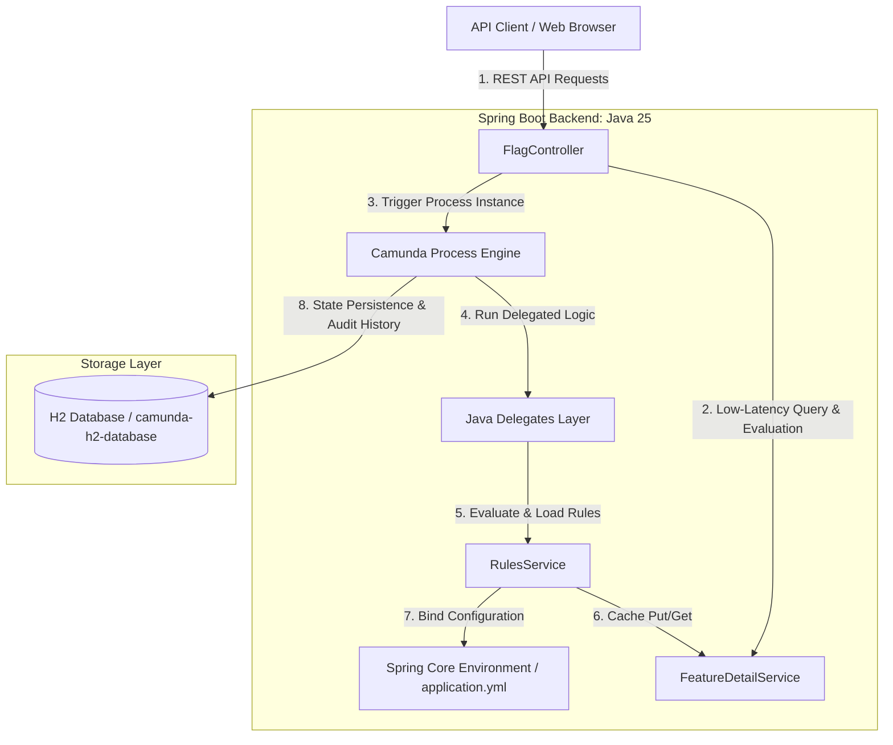
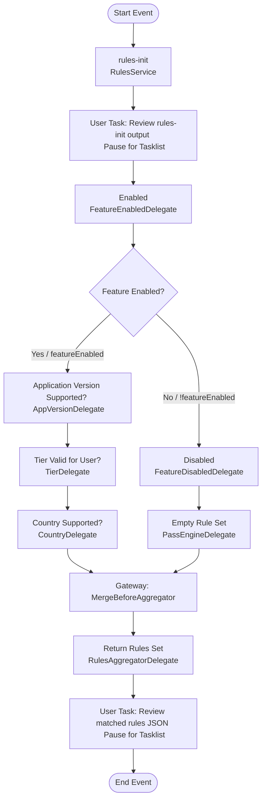
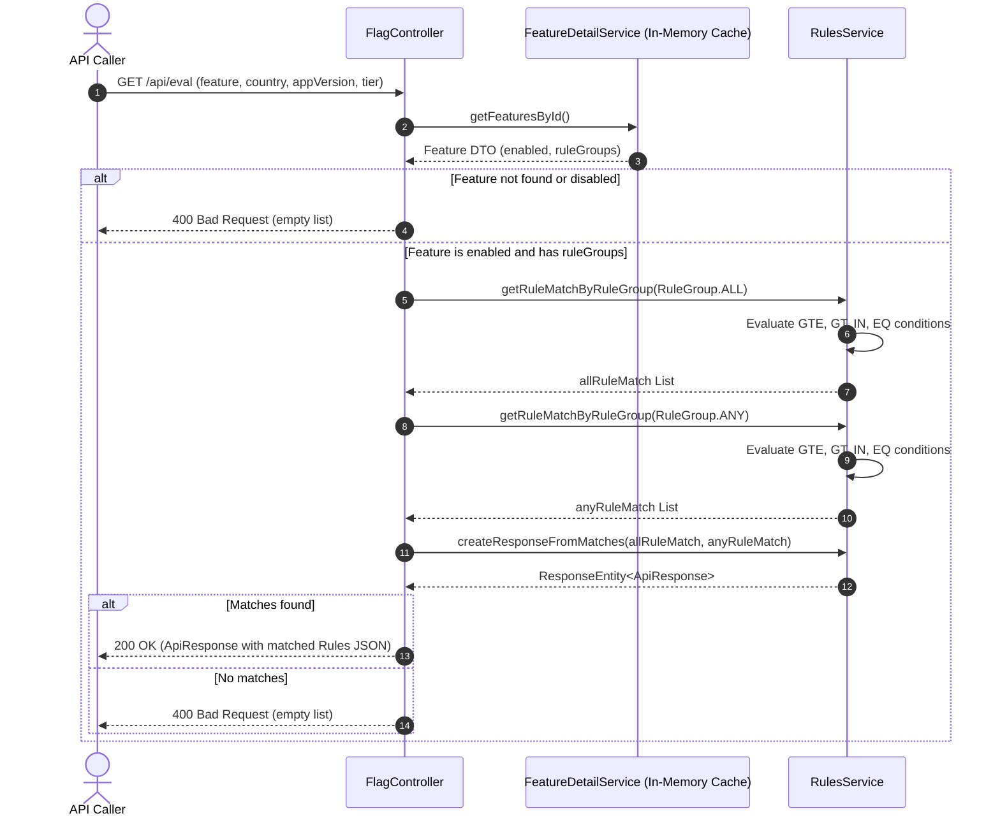

# rules-engine
## Feature Flag Evaluator - System Architecture & Design Documentation

## Executive Summary
The **Feature Flag Evaluator** is a modern, high-performance rules engine designed to determine whether specific feature flags are enabled or disabled for given target audiences. Built with **Spring Boot 3.5.x** and leveraging **Camunda Platform 7.24.0**, the system provides two distinct pathways: a sub-millisecond, low-latency API evaluation mechanism for real-time application requests, and an interactive BPMN workflow simulation path for workflow modeling, compliance, operator audit, and human-in-the-loop operational checks.

---

## 1. High-Level System Architecture

The application is structured into four core architectural tiers:
1. **API / Controller Layer:** Handles HTTP request ingestion, exposing REST endpoints for flag status evaluation, verification, and BPMN process triggering.
2. **Process Orchestration Layer (Camunda Engine):** Operates an embedded BPMN workflow engine that runs structured business logic, maintains run-time execution contexts, tracks execution states, and assigns tasks to operations personnel.
3. **Core Service & Memory-Cache Layer:** Reads rules from yaml properties, binds them into typed objects, executes matching algorithms, and caches configurations in-memory to provide lightning-fast, concurrent flag resolutions.
4. **Storage Layer:** Uses an embedded H2 file database, managed via Hibernate JPA, to persist Camunda process states, history log entries, task variables, and operational configurations.

### Architectural Blueprint (System Diagram)

Below is the conceptual layout showing how API clients, the Spring core container, the Camunda Process Engine, and the local storage layer interact:



---

## 2. Java Spring Backend Overview

The backend is built as a lightweight, reactive-friendly monolithic Spring Boot application, optimized for execution under **Java 25**. It incorporates modern language paradigms such as **Module Import Declarations** (`import module java.base;`) and **Java Records** to achieve optimal type safety and readable, concise code structures.

### Tech Stack Details
* **Spring Boot Version:** 3.5.14
* **Camunda Platform Version:** 7.24.0 (Spring Boot Starter)
* **Java Virtual Machine:** OpenJDK / GraalVM (Java 25 compatible)
* **Database Platform:** Embedded H2 Database (File-backed: `jdbc:h2:file:./camunda-h2-database`)
* **ORM & JPA Provider:** Hibernate ORM 6.6.x

### Core Component Breakdown

```
 net.ironoc.rules.engine
  ├── ApiApplication.java             # Main Application Bootstrapper
  ├── config
  │    └── JacksonConfig.java         # Customized JSON Serializers & ObjectMapper
  ├── controller
  │    └── FlagController.java        # Inbound REST API Endpoint Handler
  ├── service
  │    ├── DetailCacheI.java          # In-Memory Cache Interface
  │    ├── FeatureDetailService.java  # Concurrent In-Memory Cache Implementation
  │    ├── RuleServiceI.java          # Core Rules Engine Evaluation Interface
  │    └── RulesService.java          # Bind Configuration & Matches Rules Logic
  ├── dto
  │    ├── Feature.java               # Feature Flag DTO Record
  │    ├── RuleGroups.java            # All & Any Rules Record
  │    └── Rule.java                  # Individual Rule Condition Record
  └── enums
       ├── FeatureFlag.java           # Enumerated Evaluated Attributes (TIER, APPVERSION, COUNTRY)
       ├── RuleOperator.java          # Evaluation Operators (IN, EQ, GTE, GT)
       ├── RuleGroup.java             # Logic Groups (ALL, ANY)
       └── Country.java               # Region Enums
```

#### A. FlagController
Exposes three distinct endpoints:
* **`GET /api/test`**: Health verification endpoint that maps the standard supported countries (`Country` enum).
* **`GET /api/executetask`**: Manually fires up a `Rules_matcher` Camunda process instance. It registers current request inputs, loads initial rule sets into the execution context, and returns the unique `processInstanceId`.
* **`GET /api/eval`**: The high-performance direct flag evaluation path. It consumes request parameters (`feature`, `country`, `appVersion`, `tier`), checks the configuration in `FeatureDetailService`, executes the matching algorithm, and returns 200 OK with the array of matched rules, or a 400 Bad Request with an empty list if rules do not pass.

#### B. FeatureDetailService (Memory Cache)
Implements `DetailCacheI` using a `ConcurrentHashMap`. To eliminate slow external configurations or DB reads during flag evaluation, this cache holds pre-compiled feature and rule records in memory. 

#### C. RulesService
The brain of the evaluation system. It handles two jobs:
1. **Config Binding (`execute` method):** Programmatically binds the prefix `feature` configurations in `application.yml` directly into rich Java record representations (`Feature`, `RuleGroups`, `Rule`) using Spring's `Binder` API.
2. **Rules Evaluation (`rulesMatcher` method):** Matches incoming client parameters against target rule attributes (`FeatureFlag` attributes) utilizing targeted criteria operators. Supported operations include:
   * **`IN` & `EQ`:** Validates exact string containment/equality (e.g., verifying a country is in `[ES, PT]` or the user's tier matches `gold`).
   * **`GTE` & `GT`:** Evaluates numerical strings (e.g., validating the user's appVersion is greater than or equal to `120`).

#### D. Typed DTO Records & Enums
By relying on Java 16+ records (`Feature`, `RuleGroups`, `Rule`), the application guarantees structural immutability, thread safety, and standard serialization behaviors with minimal boilerplate.

---

## 3. BPMN Workflow Orchestration: Deep Architectural Analysis

The system relies on executable Business Process Model and Notation (BPMN 2.0) specifications deployed to the embedded Camunda engine. 

### A. Core BPMN Processes Deployed
The application deploys three separate workflows on boot:
1. **`rules-init` (Process ID `rules-init` via `first.bpmn`):** Fully automated startup helper process. Triggered automatically or via internal hooks, it executes a service task linked directly to `RulesService.execute(...)` to read from physical files (`application.yml`), perform binding, and load target configurations directly into the concurrent cache map.
2. **`Rules_matcher` (Process ID `Rules_matcher` via `rules-matcher.bpmn`):** The comprehensive execution workflow implementing conditional logical routing, custom java delegate evaluations, async state persistence boundaries, and interactive user checkpoint nodes.
3. **`loanApproval` (Process ID `loanApproval` via `loanApproval.bpmn`):** A lightweight demo user-task assignment workflow.

### B. Logical Gates & Routing Control Flow (Rules_matcher)
The `Rules_matcher` workflow incorporates specific structures to govern execution based on live evaluation states:



#### 1. Exclusive Gateways (`Gateway_0ejhppi` and `Gateway_MergeBeforeAggregator`)
* **Routing Gate (`Gateway_0ejhppi`):** Acts as a deterministic fork. It evaluates the process variable `${featureEnabled}` populated by `FeatureEnabledDelegate`. If `true`, it diverts the token down the evaluation path. If `false`, it redirects the token to the cleanup/disabled path.
* **Merging Gate (`Gateway_MergeBeforeAggregator`):** Serves as an un-synchronized convergence node. Whether the process resolved rules or skipped them entirely, both paths converge at this merge node prior to triggering rule aggregation.

#### 2. Human-In-The-Loop Interactive Checkpoints (`userTask`)
BPMN user tasks represent operational safety checkpoints:
* **`Activity_UserConfirmInit` ("Review rules-init output"):** Positioned immediately after rule loading. The process stops and presents the task in the Camunda Tasklist. This ensures that operators verify that features and rule definitions are properly loaded from YAML configurations before actual criteria matching starts.
* **`Activity_UserReviewRulesJson` ("Review matched rules JSON"):** Positioned immediately after aggregate evaluation. This blocks completion until an operator claims and completes the task in the Camunda Tasklist. This acts as a manual audit boundary to inspect the serialized `rulesJson` result.

#### 3. Asynchronous Execution Boundaries (`camunda:async`)
The Service Task **`Activity_1pygerh` ("Return Rules Set")** is configured with `camunda:asyncBefore="true"` and `camunda:asyncAfter="true"`:
* **`asyncBefore=true`:** Before entering the delegate, the engine commits the current database transaction. The execution thread is released back to the caller (e.g. the HTTP request), and a background job is scheduled. The Camunda Job Executor picks up the task and runs `RulesAggregatorDelegate` in a background worker thread.
* **`asyncAfter=true`:** Immediately after the delegate completes its work, the engine commits the state variables and saves the updated matched rules back to the database, ensuring zero data loss before transitioning to the subsequent user task checkpoint.

---

## 4. Java Delegates: Deep-Dive Implementation & State Transitions

Each service node in the `Rules_matcher` process is backed by a specific Java class implementing `org.camunda.bpm.engine.delegate.JavaDelegate`. These classes orchestrate process state transitions by reading, updating, and removing execution variables.

Below is an exhaustive account of each delegate's responsibilities, input/output variables, and internal execution logic:

```
┌────────────────────────────────────────────────────────────────────────────────────────────┐
│                                 RULES_MATCHER PROCESS                                      │
│                                                                                            │
│  [Start] ──> [rules-init]                                                                 │
│                   │                                                                        │
│                   ▼                                                                        │
│          (Task: Review rules-init)                                                         │
│                   │                                                                        │
│                   ▼                                                                        │
│            [FeatureEnabled] ─────────────────────────────────────────┐                     │
│                   │                                                  │                     │
│         (featureEnabled == true)                           (featureEnabled == false)       │
│                   │                                                  │                     │
│                   ▼                                                  ▼                     │
│            [AppVersion]                                      [FeatureDisabled]             │
│                   │                                                  │                     │
│                   ▼                                                  ▼                     │
│               [Tier]                                           [PassEngine]                │
│                   │                                                  │                     │
│                   ▼                                                  │                     │
│              [Country]                                               │                     │
│                   │                                                  │                     │
│                   └─────────────────────────► ◄──────────────────────┘                     │
│                                               │                                            │
│                                               ▼                                            │
│                                      [RulesAggregator]                                     │
│                                               │                                            │
│                                               ▼                                            │
│                                   (Task: Review rules JSON)                                │
│                                               │                                            │
│                                               ▼                                            │
│                                             [End]                                          │
└────────────────────────────────────────────────────────────────────────────────────────────┘
```

---

### A. `FeatureEnabledDelegate`
* **Purpose:** Acts as the primary context initializer. It queries the cache to check if the target feature is enabled and loads rule sets into the active process execution scope.
* **Class Path:** `net.ironoc.rules.engine.delegate.FeatureEnabledDelegate`
* **State Transitions:**
  * **Inputs (Read):**
    * `feature` (String): The ID of the feature flag to evaluate.
  * **Outputs (Written):**
    * `featureEnabled` (Boolean): Flag representing whether the requested feature is active.
    * `featureDto` (Feature - Java Record): The fully populated Feature object containing logical groups.
    * `ruleGroupsAll` (Map<String, Map<String, Object>>): Rule sets that must pass AND conditions (mapped from `feature.ruleGroups().all()`).
    * `ruleGroupsAny` (Map<String, Map<String, Object>>): Rule sets that must pass OR conditions (mapped from `feature.ruleGroups().any()`).
  * **Scope Removals (On Feature Disabled/Missing):**
    * Removes variables `featureDto`, `ruleGroupsAll`, and `ruleGroupsAny` from the execution context to prevent stale configuration pollution.
* **Detailed Steps:**
  1. Retrieves the string value of the process variable `"feature"`. If null, defaults to empty.
  2. Queries the concurrent cache (`featureDetailsService.getFeaturesById()`) using the feature ID.
  3. Evaluates if the feature is non-null and `feature.enabled()` is true.
  4. Calls `execution.setVariable("featureEnabled", enabled)`.
  5. If `enabled` is `true`, extracts the underlying logical `ruleGroups` configurations and registers them as serialized process variables (`"featureDto"`, `"ruleGroupsAll"`, `"ruleGroupsAny"`) so downstream delegates can access them.
  6. If `disabled` or `missing`, calls `execution.removeVariable(...)` for all feature-specific parameters and logs the cleanup.

---

### B. `FeatureDisabledDelegate`
* **Purpose:** Forces a process-level override to disable the active feature context. Used exclusively in the "Disabled" branch of the gateway.
* **Class Path:** `net.ironoc.rules.engine.delegate.FeatureDisabledDelegate`
* **State Transitions:**
  * **Inputs (Read):** None.
  * **Outputs (Written):**
    * `featureEnabled` (Boolean): Overridden to `false`.
  * **Scope Removals:**
    * Clears variables `featureDto`, `ruleGroupsAll`, and `ruleGroupsAny` from the execution scope.
* **Detailed Steps:**
  1. Calls `execution.setVariable("featureEnabled", false)` to ensure that any conflicting upstream evaluation is overridden.
  2. Removes variables `"featureDto"`, `"ruleGroupsAll"`, and `"ruleGroupsAny"` to prevent evaluation.
  3. Logs the cleanup sequence.

---

### C. `PassEngineDelegate`
* **Purpose:** Bypasses evaluation steps when a feature is disabled, short-circuiting rule execution.
* **Class Path:** `net.ironoc.rules.engine.delegate.PassEngineDelegate`
* **State Transitions:**
  * **Inputs (Read):** None.
  * **Outputs (Written):**
    * `skipRulesEngine` (Boolean): Set to `true`.
    * `matchedRules` (List<Rule>): Initialized to an empty `ArrayList<Rule>()`.
* **Detailed Steps:**
  1. Sets process variable `"skipRulesEngine"` to `true` to signal downstream aggregators that rule matching should be skipped.
  2. Instantiates an empty `ArrayList<Rule>` and binds it to the process variable `"matchedRules"`.
  3. Logs the bypass transition.

---

### D. `AppVersionDelegate`
* **Purpose:** Extracts, normalizes, and captures client-supplied application version parameters.
* **Class Path:** `net.ironoc.rules.engine.delegate.AppVersionDelegate`
* **State Transitions:**
  * **Inputs (Read):**
    * `appVersion` (String): Raw client-submitted application version.
  * **Outputs (Written):** None (captures and sanitizes parameters; actual matching executes in the aggregator).
* **Detailed Steps:**
  1. Retrieves the execution variable `"appVersion"`.
  2. Converts the value to a string, trims whitespace, and defaults to empty if null.
  3. Logs the captured parameter for trace visibility.

---

### E. `TierDelegate`
* **Purpose:** Extracts, normalizes, and captures client-supplied tier parameters.
* **Class Path:** `net.ironoc.rules.engine.delegate.TierDelegate`
* **State Transitions:**
  * **Inputs (Read):**
    * `tier` (String): Raw client-submitted subscription tier.
  * **Outputs (Written):** None.
* **Detailed Steps:**
  1. Retrieves the execution variable `"tier"`.
  2. Normalizes, trims, and defaults the value.
  3. Logs the normalized value.

---

### F. `CountryDelegate`
* **Purpose:** Extracts, normalizes, and captures client-supplied country parameters.
* **Class Path:** `net.ironoc.rules.engine.delegate.CountryDelegate`
* **State Transitions:**
  * **Inputs (Read):**
    * `country` (String): Raw client-submitted country code.
  * **Outputs (Written):** None.
* **Detailed Steps:**
  1. Retrieves the execution variable `"country"`.
  2. Normalizes, trims, and defaults the value.
  3. Logs the normalized value.

---

### G. `RulesAggregatorDelegate`
* **Purpose:** Aggregates and evaluates rule matching across different groups (AND / OR) and serializes results into an audited process string.
* **Class Path:** `net.ironoc.rules.engine.delegate.RulesAggregatorDelegate`
* **State Transitions:**
  * **Inputs (Read):**
    * `skipRulesEngine` (Boolean): Check to skip criteria matching.
    * `featureEnabled` (Boolean): Check if feature is active.
    * `country` (String): Client's country code.
    * `appVersion` (String): Client's application version.
    * `tier` (String): Client's subscription tier.
    * `feature` (String): Target feature ID.
  * **Outputs (Written):**
    * `matchedRules` (List<Rule>): List of matched rule records.
    * `rulesJson` (String): JSON serialized string containing matching rules, rendered directly in Camunda Tasklist.
* **Detailed Steps:**
  1. Evaluates process variables `"skipRulesEngine"` and `"featureEnabled"`.
  2. **Short-Circuit Evaluation:** If `skipRulesEngine` is `true` or `featureEnabled` is `false`, sets `matchedRules` to an empty `ArrayList<Rule>()`.
  3. **Full Match Evaluation:**
     * Retrieves client arguments: `country`, `appVersion`, `tier`, and `featureId`.
     * Retrives the feature details from cache.
     * Invokes `rulesService.getRuleMatchByRuleGroup(...)` for logical group `ALL` (representing criteria that must all match / AND).
     * Invokes `rulesService.getRuleMatchByRuleGroup(...)` for logical group `ANY` (representing criteria where at least one must match / OR).
     * Compiles rules from both groups using `rulesService.createResponseFromMatches(...)`.
  4. Binds the resulting list of matches to the process variable `"matchedRules"`.
  5. Serializes the match collection to a JSON string using Jackson `objectMapper`.
  6. Saves the JSON string as the process variable `"rulesJson"`.
  7. Logs execution metrics (e.g., number of aggregated rules matched).

---

## 5. Camunda Modeler and Console Usage

The integration of Camunda provides a robust framework to visualize, monitor, audit, and walk through business rules interactively.

### A. Modeler Usage
Architects, product owners, and developers use the **Camunda Modeler** to edit `.bpmn` files. Modeler features utilized in this codebase include:
* **Service Tasks:** Executed automatically by referencing Spring Beans or Java Delegates (e.g., `camunda:class="net.ironoc.rules.engine.delegate.FeatureEnabledDelegate"`).
* **Exclusive Gateways:** Controls routing based on expression variables (e.g., evaluating `${featureEnabled}` vs `${!featureEnabled}`).
* **User Tasks:** Introduces deliberate pause points (such as `Review rules-init output` or `Review matched rules JSON`) to allow administrators to examine intermediate results via the web UI.
* **Asynchronous Continuations:** Configured on key tasks via `camunda:asyncBefore="true"` or `camunda:asyncAfter="true"`. This instructs the engine to commit the current transaction to the database, allowing background job executors to handle execution, preventing long-running operations from blocking HTTP request threads.

### B. Embedded Camunda Web Console
Upon booting the application, the Camunda Platform Cockpit, Tasklist, and Admin interfaces are hosted at `http://localhost:8080/` (Admin credentials default to: `sa` / `passw`).

#### 1. Camunda Cockpit (Execution Monitor)
Provides an overview of running processes. Operators use it to:
* View active process instances and pinpoint exactly which task token is currently executing.
* Analyze historical executions, audit paths taken, and trace variables.
* Perform runtime interventions (e.g., re-run a failed delegate step or manually edit process variables like `country` or `appVersion` during live execution).

#### 2. Camunda Tasklist (Human Workflow Handler)
The interactive interface for operations teams. Because the `Rules_matcher` workflow incorporates User Tasks, executing a workflow creates a task entry here.
* **Review rules-init output:** The operator inspects the loaded feature configuration from yaml before evaluating rules.
* **Review matched rules JSON:** The operator views the aggregated matches stored in `rulesJson` before completing the process.
* Operators claim, view, update values, and complete tasks to push the process to the next step.

#### 3. Camunda Admin Panel (Security & Configuration)
Controls user authentication, authorizations, and filter creation (e.g., configures the "All tasks" filter used to display pending user tasks in the Tasklist).

---

## 6. Detailed Data Flow & Execution Lifecycles

The Feature Flag Evaluator supports two distinct execution paths depending on performance and audit requirements:

### Path A: Low-Latency REST API Path (`/api/eval`)
Designed for live production traffic requiring sub-millisecond responses.



### Path B: BPMN-Driven Interactive Path (`/api/executetask`)
Designed for process tracing, visual auditing, and manual user checkpoints.

1. **Triggering:** The client calls `GET /api/executetask`. The `FlagController` starts the `Rules_matcher` BPMN process via the Camunda Runtime Service.
2. **Rule Binding (`rules-init` Service Task):** Executes `RulesService`. It binds rule specifications from `application.yml` and updates `FeatureDetailService`.
3. **Manual Gateway Pause (`Review rules-init output` User Task):** The process pauses. The operator claims and completes the task in Camunda Tasklist.
4. **Context Evaluation (`Enabled` Service Task):** Runs `FeatureEnabledDelegate`. It extracts the process variable `feature`. It checks the cache, sets `featureEnabled` to `true` or `false`, and pushes rule configurations into process variables (`ruleGroupsAll`, `ruleGroupsAny`).
5. **Gateway Routing (`Feature Enabled?` Exclusive Gateway):**
   * **If Enabled:** Routes to evaluation delegates:
     - `AppVersionDelegate`: Captures and logs `appVersion`.
     - `TierDelegate`: Captures and logs `tier`.
     - `CountryDelegate`: Captures and logs `country`.
   * **If Disabled:** Routes to teardown delegates:
     - `FeatureDisabledDelegate`: Formally overrides `featureEnabled` to false and clears remaining cache variables.
     - `PassEngineDelegate`: Signals that rules should be skipped (`skipRulesEngine=true`) and initializes an empty matched rules array.
6. **Merging & Aggregation (`Return Rules Set` Service Task):** Merges both flows and routes to `RulesAggregatorDelegate`.
   - If rules are skipped or the feature is disabled, it constructs an empty match list.
   - Otherwise, it reads the input variables (`country`, `appVersion`, `tier`, `feature`), uses `RulesService` to match criteria against rule attributes, aggregates all valid rules, saves them to `matchedRules`, and serializes the list to a process variable string `rulesJson`.
7. **Final Review Pause (`Review matched rules JSON` User Task):** Pauses the process. An operator reviews the compiled rules in `rulesJson` inside the Tasklist. Once approved, the task is marked complete, and the instance finishes.

---

## 7. Testing & Architectural Integrity

The system guarantees robust operations via its comprehensive, self-contained test suite containing **9 distinct unit and integration tests** distributed across these target segments:

1. **`JacksonConfigTest`:** Validates customized JSON serialization configurations, ensuring records and complex maps serialize smoothly.
2. **`ContextLoadsTest`:** Boots up the full Spring Application Context, verifies Hibernate mappings, initializes the Hikari Connection Pool to the local H2 file database, and checks that Camunda BPMN processes (`rules-matcher.bpmn`, `first.bpmn`, `loanApproval.bpmn`) deploy cleanly.
3. **`RulesServiceTest` (Unit Tests):** Tests the parsing engine logic in isolation. It verifies:
   * Logical country string inclusions (`IN`).
   * Numerical application version comparisons (`GTE`, `GT`).
   * Safe handling of unsupported criteria operators.
4. **`FlagControllerTest` (Controller Mock Tests):** Exercises flag-evaluation REST endpoints directly, validating appropriate HTTP response codes (200 OK vs 400 Bad Request) for diverse execution scenarios (e.g., missing features, disabled flags, or composite rule criteria matches across both ALL and ANY groups).

This comprehensive architecture maintains highly performant runtime capabilities alongside rigorous operational oversight, meeting both enterprise-grade API performance demands and corporate compliance goals.
